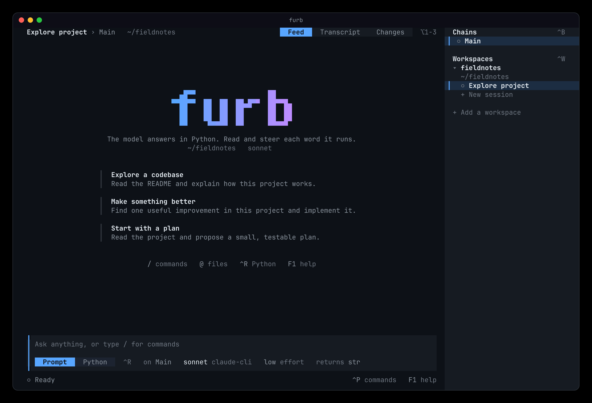

<div align="center">

# furb

**The model answers in Python. You read and steer each word it runs.**

[](https://github.com/uael/furb/actions/workflows/gates.yml)



</div>

## What makes furb different

Most harnesses give a model a menu of tools and read one JSON call at a time. furb gives the model a Python
module, and each answer of the model is a program that runs in it.

- **One answer, one program.** In one word, the model can read files, run commands, ask other models, wait,
  and combine the results with loops and conditions. It does not have to spend one turn on each call.
- **The system prompt is one file that you can read.** The engine is `src/furb/engine.py`. Minified, it is the
  whole system prompt, and it costs fewer than 6000 tokens. No text is hidden from you.
- **Every word is checked before it runs.** A type checker reads each word first. A word that it refuses never
  runs, so it has no effects, and the model reads why.
- **Work runs side by side.** A command, a question to a model, and a wait are acts that a word can await
  together. Chains work in parallel, and each chain has its own module and folder.
- **Rewind to any point.** A new chain can start from any point of another chain. In the TUI, press Escape twice
  to open the rewind tree.
- **You see what the model sees.** The transcript is the exact text that the model reads. The record keeps every
  fact, and a later run replays it. Work that was interrupted starts again when you resume it.
- **Limits that hold.** A chain pauses when it reaches a dollar ceiling or a share of the context window.
- **The model can ask you.** A question to the operator waits in the feed until you answer it.
- **One contract, proven twice.** `src/furb/engine.pyi` holds each law of the engine as one sentence, and the
  suite has one test for each sentence. The suite runs on CPython, and on monty, a Python interpreter written in
  Rust.

## Try it

```sh
pip install furb                     # The engine and the furb command. It needs Python 3.14 or later.
```

The TUI runs from a clone of this repository, with Bun 1.4.2 or later:

```sh
bun install && bun run build
bun run demo                         # A scripted life on a sample project. It asks no model.
bun run tui                          # A real life, through the claude command line.
```

## Learn more

- [The TUI](tui/README.md): the views, the keys, the commands, and [a gallery of each screen](docs/tui.md).
- [The developer guide](docs/developer-guide.md): how the repository fits together, and how to change it.
- [The contract](src/furb/engine.pyi): every law of the engine, one sentence per line.

## License

> Copyright (C) 2026 Abel Lucas. furb is free software under the GNU Affero General Public License, version 3,
> which `LICENSE` holds. You may use, study, change, and share it. Anyone who ships it, or who runs a changed furb
> as a service, must offer the source under the same terms. The engine carries no notice of its own, because its
> text is the system prompt of a model and every word of it counts.
